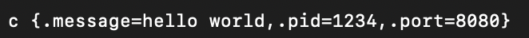
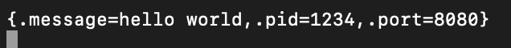
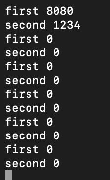
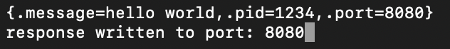
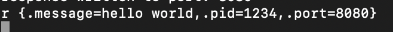
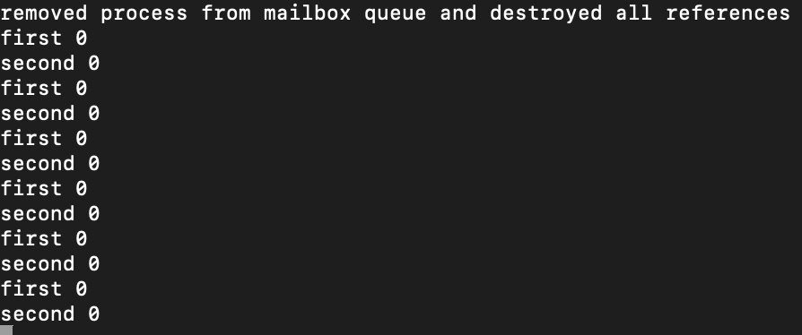

# microipc
micro IPC simulation of the Kernel in User Space for macOS

## Concept, Design & Approach

Due to the fact that this is user sapce only, the "kernel" in this project is a server that serves as a Unix Domain Socket (UDS). 

This socket lets multiple processes send requests and are treated as a server process and client process. The "Kernel" just forwards messages to each process through the corresponding mailbox queue.

The concept is simple, yet the design is advanced. For simplicity sake, the scalability of this porject is limited to 6 simulated processes only.

### Communication

To actually send data and communicate between other processes, you must follow a serialised format.

```c
struct mipc_process_request_t {
    char message[255];
    char recv[255];
    unsigned int pid;
    unsigned int port;
};
```

This structure must be serialised in a string format and sent to the "Kernel".

```
{.message=string here,.pid=1234,.port=8080}
```

This format is only accepted. If the server does not receive this, then it does not accept the simulated process as valid.

### Demonstration

To actually trigger the server to perform an action, you must send specific commands to trigger the simulation:

`c <serialised_structure>` - Creates a process in the "Kernel" and is inserted into a process table, waiting for communication

`<serialised_structure>` - Sending the structure again itself will trigger the "Kernel" to check if the passed `port` actually exists in the process table. If it does exist, it will be moved into a mailbox queue along with the `pid` of the client process that wants to communicate with it.

`serialised_structure` - Sending the exact same structure again will trigger the "Kernel" to look for the corresponding mailbox queue that contains the server process `port` and the client process `pid`. If found, the `message` passed is written to the server process and a response message is written back to the client process.

`r <serialised_structure>` - Removes the given process from the process table if it exists, otherwise if it exists inside multiple mailbox queues, all those queues are destroyed and the link between two processes is terminated.

### Further Breakdown



We are creating a new process (port 8080) is inserted into the process table.

---





The two screenshots above show how a mailbox queue is created. First, we need to ensure an existing process in the process table with the corresponding port actually exists, hence why we run `c <serialised_structure>` first.

When we just run `serialised_structure` it tells the "Kernel" to look for a process in the process table with the port 8080 and create a mailbox queue for it.

Once the mailbox queue is created the first slot is the process with port 8080 and the second slot is the client process which is pid 1234. Now our simulated "Kernel" has successfully setup a link between two simulated processes in a simulated queue.

---




Once the following steps above have been executed successfully, if we just run `serialised_structure` again, this time we tell our "Kernel" to look for a mailbox queue that has the first slot with a port of 8080 and the second slot of pid 1234. If this has been found, the "Kernel" will write to the process with port 8080. This is simulating writing to a server process from a client process.

You can see the action was executed and simulated successfully because the second screenshot prints "hello world" which is exactly what our client passed through the `message` attribute.

---




Running the `r <serialised_structure> command will tell the Kernel to first lookup the process of port 8080 inside the process table. If it does exist, it will be destroyed. However, if it does not exist inside the process table but inside a mailbox queue, that queue is destroyed. If there are multple mailbox queues with the same port, all those queues are destroyed.

As you can see the operation successfully executed because all the first and second slots (each represent a mailbox queue) are now empty.

That is my simulated Kernel running Message Passing through a custom implemented IPC mechanism I've designed from what I've learnt about Processes, IPC, Operating Systems, etc.

## Problems Encountered

By design, the process table and mailbox queues are a fixed array of 6. 

Everytime you move a process in or out of the process table, you risk the array becoming fragmented. This was a real problem I faced when designing this system.

The same issue was also occuring inside the array that stores mailbox queues.

### Solution for Process Tables

I solved this by not re-sorting the array once a remove operation has been executed, that would be a little slow and not really needed. Since it's a small, linear array, I keep track of the last removed index. 

If the element removed is not at the end of the array, I keep track of that index so whenever I insert into the array, I use that index first and if the end of the array isn't filled we resume the regular index. This immediately de-fragments the array without re-sorting and works efficiently. If the last element was removed at the end, we don't need to keep track of the last removed index since it isn't fragmented.

### Solution for Mailbox Queues

This one is slightly different, since it works a little differently, I chose not to keep track of the last index removed from.

Still, we don't completely re-sort the entire array everytime a remove operation is done. This was the most effective solution I came up with:

- We copy all the elements into a temporary array that we want to keep (excluding the element we are trying to remove)
- The original array is reset
- The temporary array is copied into the original array

This de-fragments the array, and keeps the mailbox queues ordered with no gaps. I believe this was the most effective way of removing queues from the array without overcomplicating the design.

## What I've achieved

I've successfully designed and implemented the system myself to demonstrate understanding of C programming, memory management, data structures & algorithms and Operating System concepts (such as Processes, IPC, Memory, etc).

### Approaches

- Multiple client handling achieved using Kernel Queue Datastructure (and systemcalls)
- Sorting and Queue Dispatching
- Parsing
- Memory

### Data Structures
- Kernel Queue / Events
- Sorting

I've also done my best to keep it simplified with abstracting but not over doing it.

## Final Notes

Plesae remember this project is to demonstrate skills and represents an educational understanding of how IPC Message Passing works. Please do not use this in a production environment as this is was designed for simplicity and learning.

## License and Credits
Developed by Mustafa Malik
<br/>
Licensed under the GNU GPL v3 License